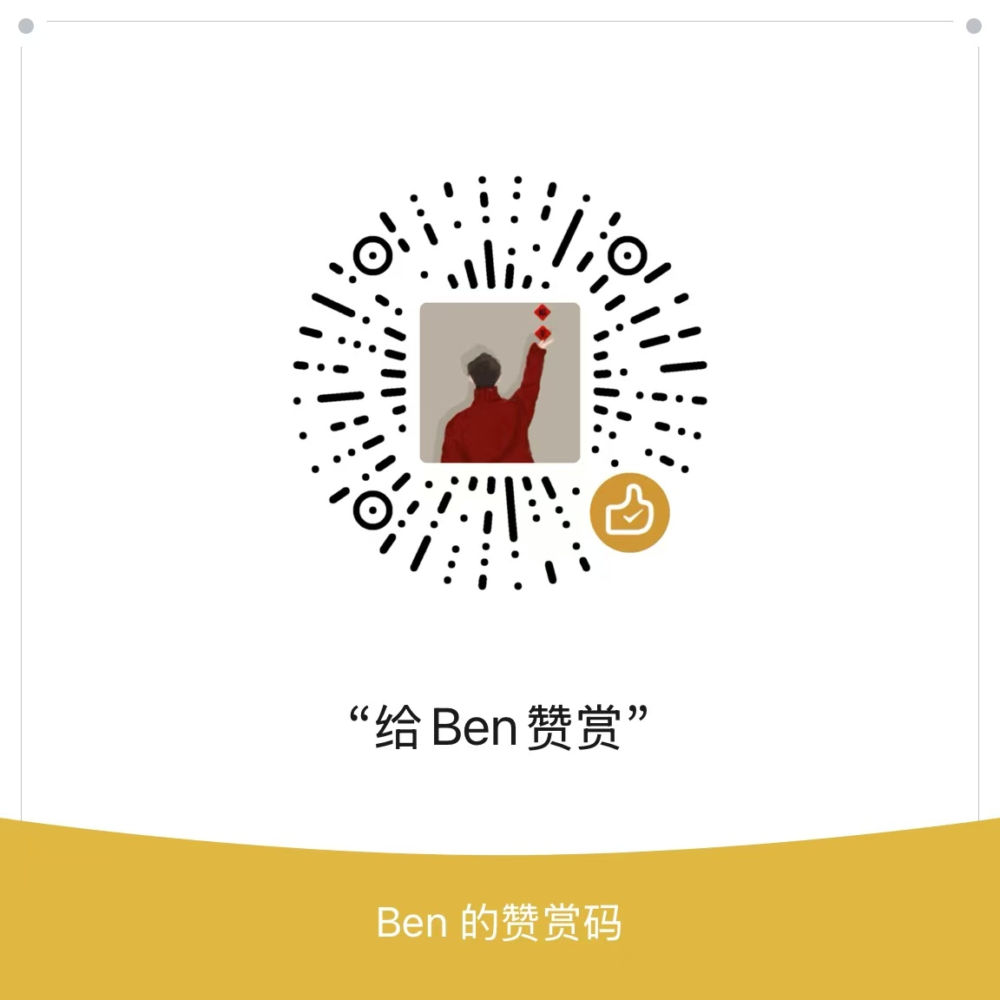

# AlphaBot - 你的专属智能投资助理

一个基于多数据源和多种分析模式的智能股票分析助手，帮助投资者做出更明智的投资决策。

## 项目概述

AlphaBot是一个全栈应用程序，由后端 API 和前端界面组成。它能够获取全球和中国股票市场数据，提供技术分析、基本面分析和 AI 驱动的投资建议。

## 免责声明

```markdown
**重要提示：请在使用本项目前仔细阅读以下免责声明**

1. **非投资建议**：本项目提供的所有分析、预测和建议仅供学习和研究使用，不构成任何投资建议或交易指导。用户不应将本项目的输出作为投资决策的唯一依据。

2. **市场风险**：股票市场受多种因素影响，包括但不限于经济政策、公司基本面、市场情绪等，任何预测模型都无法完全准确地预测市场走势。投资股票市场存在本金损失的风险。

3. **模型局限性**：
   - 本项目的机器学习模型基于历史数据训练，过去的表现不代表未来的结果
   - AI分析结果可能存在偏差、错误或不完整的情况
   - 技术指标和分析方法有其固有的局限性

4. **用户责任**：
   - 使用本项目进行投资决策需自行承担风险
   - 用户应对自己的投资决策负全部责任
   - 在做出任何投资决策前，建议咨询专业的投资顾问，并进行充分的研究和分析

5. **数据来源**：本项目使用的数据来自第三方数据源（如Alpha Vantage、Tushare、AKShare等），我们不对这些数据的准确性、完整性或及时性做任何保证。

6. **责任限制**：项目开发者和贡献者不对因使用本项目导致的任何直接或间接损失负责，包括但不限于投资损失、利润损失、业务中断等。

7. **适用性**：本项目不考虑个人的投资目标、财务状况或特定需求，用户应根据自身情况谨慎决策。

**使用本项目即表示您已阅读、理解并同意上述免责声明的所有条款。**
```

## 功能特点

- **多数据源支持**：
  - Alpha Vantage：提供全球股票市场数据
  - Tushare：专注于中国股票市场数据
  - AKShare：开源财经数据接口

- **多种分析模式**：
  - 规则计算分析：基于技术指标和基本面数据的规则计算
  - 机器学习模型分析：使用训练好的机器学习模型进行预测
  - 大语言模型分析：利用 OpenAI API 进行深度分析

- **核心功能**：
  - 股票搜索和基本信息查询
  - 历史价格数据和图表展示
  - 技术指标计算和可视化
  - AI 驱动的投资建议和风险评估
  - 用户收藏和投资组合管理

## 项目架构

### 后端 (backend/)

- **技术栈**：Python, FastAPI, SQLAlchemy, Pandas
- **主要组件**：
  - 多数据源适配器
  - AI 分析服务
  - RESTful API 接口

### 前端 (frontend/)

- **技术栈**：React, TypeScript, Ant Design, ECharts
- **主要组件**：
  - 股票搜索和详情页面
  - 交互式图表和技术指标
  - AI 分析结果展示

## 快速开始

### 方法一：使用 Docker（推荐）

项目提供了 Docker Compose 配置和一键部署脚本，可以快速部署整个应用。

#### 前提条件

- Docker 和 Docker Compose 已安装

#### 部署步骤

1. 克隆仓库
```bash
git clone https://github.com/x-pai/ai-stock-assistant.git
cd ai-stock-assistant
```

2. 运行部署脚本
```bash
./deploy.sh
```

部署脚本会自动执行以下操作：
- 检查环境配置
- 训练机器学习模型（如果需要）
- 构建并启动服务
- 显示访问地址

3. 访问应用
- 后端 API 文档：http://localhost:8000/api/docs
- 前端界面：http://localhost:3000

### 方法二：手动安装

#### 后端

```bash
cd backend
pip install -r requirements.txt
# 配置 .env 文件
python train_model.py  # 可选，训练机器学习模型
uvicorn app.main:app --reload
```

#### 前端

```bash
cd frontend
npm install
npm start
```

## 项目文档

- [后端 API 文档](backend/README.md)
- [前端开发文档](frontend/README.md)
- [开发计划](TODO.md)

## Docker 部署详情

项目使用 Docker Compose 进行容器编排，包含以下服务：

- **backend**: 后端 API 服务
  - 构建自 `./backend/Dockerfile`
  - 暴露端口 8000
  - 挂载卷以持久化数据和模型

- **frontend**: 前端 Web 界面
  - 构建自 `./frontend/Dockerfile`
  - 暴露端口 3000
  - 使用 Nginx 提供静态文件服务

### 手动部署 Docker

如果不使用部署脚本，也可以手动执行以下命令：

```bash
# 构建服务
docker-compose build

# 启动服务
docker-compose up -d

# 查看日志
docker-compose logs -f

# 停止服务
docker-compose down
```

### 自定义配置

可以通过修改以下文件自定义部署配置：

- `docker-compose.yml`: 修改端口映射、卷挂载等
- `backend/.env`: 配置后端环境变量
- `backend/Dockerfile`: 自定义后端构建过程
- `frontend/Dockerfile`: 自定义前端构建过程
- `frontend/nginx.conf`: 自定义 Nginx 配置

## 后续开发计划 (TODO)

### 后端优化

- [ ] 添加用户认证和授权系统
- [ ] 实现用户投资组合管理功能
- [ ] 优化机器学习模型，提高预测准确性
- [ ] 添加更多技术指标和分析方法
- [x] 实现数据缓存机制，提高 API 响应速度
- [x] 添加定时任务，自动更新股票数据
- [ ] 实现回测系统，验证分析策略有效性
- [ ] 添加更多数据源支持（如 Yahoo Finance）
- [ ] 开发 WebSocket 接口，提供实时数据更新

### 前端开发

- [x] 设计并实现用户界面
- [x] 创建交互式股票图表组件
- [x] 实现技术指标可视化
- [x] 开发 AI 分析结果展示页面
- [ ] 添加用户投资组合管理界面
- [ ] 实现响应式设计，支持移动设备
- [ ] 添加多语言支持
- [x] 实现主题切换功能（明/暗模式）

### 功能扩展

- [ ] 添加股票筛选和排序功能
- [ ] 实现股票对比分析功能
- [x] 添加行业和板块分析
- [ ] 开发市场情绪指标
- [ ] 实现自定义分析策略
- [ ] 添加预警和通知系统
- [x] 开发 API 使用文档和示例
- [ ] 实现数据导出功能

### 部署和运维

- [x] 配置 Docker 和 Docker Compose
- [x] 创建一键部署脚本
- [ ] 设置 CI/CD 流程
- [ ] 实现自动化测试
- [ ] 配置监控和日志系统
- [ ] 优化性能和扩展性
- [ ] 实现数据备份和恢复机制

## 贡献指南

欢迎贡献代码、报告问题或提出新功能建议。请遵循以下步骤：

1. Fork 项目
2. 创建功能分支 (`git checkout -b feature/amazing-feature`)
3. 提交更改 (`git commit -m 'Add some amazing feature'`)
4. 推送到分支 (`git push origin feature/amazing-feature`)
5. 创建 Pull Request

## 关注我们

公众号：
<div align="center">
  
</div>

微信群：
<div align="center">
  
</div>

QQ群：[点击链接加入群聊【AlphaBot交流群】](https://qm.qq.com/q/ES8Fp8AdpY)

## 赞助本项目

如果您觉得这个项目对您有帮助，欢迎赞助我们，支持项目的持续开发和维护。

<div align="center">
  
  <p>微信扫码赞助</p>
</div>

每一笔赞助都将用于：
- 服务器和基础设施维护
- 新功能开发和技术升级
- 社区活动和用户支持

感谢您的支持！

## 许可证

Apache License 2.0
